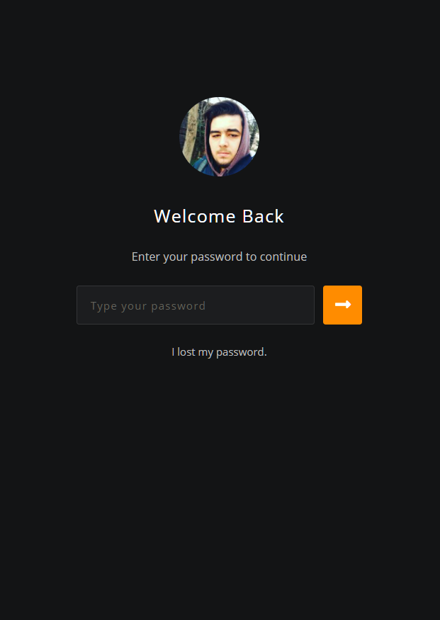
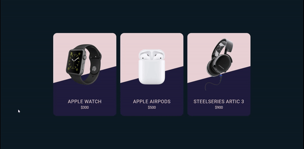

# CSS-Contents
This repository includes all of my design projects.Feel free to use everything includes this repository.

# Contents

| Number | Project Name                  |
| ---    | ---                           |
| 1      | Brand Landing Page            |
| 2      | Responsive Login Page         |
| 3      | Responsive Movie Website      |
| 4      | Travel Cards                  |
| 5      | Product Cards                 |

# 1) Brand Landing Page
This page is simple presentation for any product.You can specify the background video and gradient colors.You can find the demo of this page down below.

# 2) Responsive Login Page
This page is simple login page for websites..You can find the screenshots of this page down below.

# 3) Responsive Movie Website
This is the one page movie website design.You can specify the theme of the website by simply pressing the circle down right corner of this page..You can find the demo of this page down below.

---

# 4) Travel Cards
This page is simple travel cards for blog websites.You can pick any color of the card and use easily.You can find the demo of this page down below.

# 5) Product Cards
This page is simple product cards for e-commerce websites.You can pick any color of the card and use easily.You can find the demo of this page down below.

